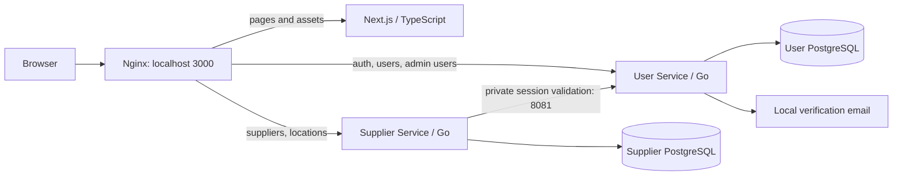
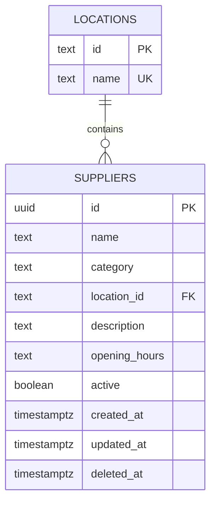

# Supplier Service: D2 design and demonstration

This guide maps the supplied D2 Supplier expectations to the implementation. It is
a demonstration plan, not a claim about a grade or the full project's completion.

## Responsibilities and request flow



Next.js presents the screens. Nginx routes browser requests to the right container.
Supplier owns its business rules and database; User owns credentials, roles and
server-side sessions. Supplier never queries User's database. Both have independent
Go processes, migrations, database credentials and persistent volumes. Compose DNS
connects them locally. Direct Supplier port 8083 exists for development/API demos.

```mermaid
sequenceDiagram
    actor Admin
    participant UI as Browser / UI
    participant S as Supplier API
    participant U as User internal API
    participant DB as Supplier PostgreSQL
    Admin->>UI: Save supplier
    UI->>S: POST /api/v1/suppliers + session cookie + Origin
    S->>U: Validate cookie using backend credential
    U-->>S: User ID, current roles, expiry
    alt Admin role present
        S->>DB: Validated INSERT; constraints enforce uniqueness
        DB-->>S: UUID, timestamps and saved record
        S-->>UI: 201 saved supplier
        UI-->>Admin: Saved record and refreshed catalogue
    else Ordinary user
        S-->>UI: 403 admin_required (no write)
    end
```

Missing/revoked sessions return 401. A User validation outage returns 503 and the
Supplier request fails closed. Validation is not positively cached, so logout and
role revocation affect the next request. A request already authorized may finish.
The browser never receives the private backend credential. Session cookies are
HttpOnly; mutation endpoints require the configured Origin. HTTPS and secure
cookies must be configured before cloud deployment.

## Roles and capabilities

| Actor | Supplier capabilities |
| --- | --- |
| Anonymous | Account signup/login only; Supplier APIs return 401 |
| User | List/search/filter/sort/page, view active and inactive details, read campus locations |
| Admin (also a User) | All reads plus create, edit, deactivate/reactivate and delete |

The UI hides admin actions from ordinary users. The Go middleware independently
checks the role on every write, so bypassing the UI does not grant permission.
Returning to a tab rechecks the session; 401 clears the catalogue and open forms.
Requester/courier are future order participation modes, not separate Supplier roles.

The first admin is created with the controlled User Service operator command:

```sh
docker compose exec user-service user-service promote-admin your-verified-email@u.nus.edu
```

Log in again afterward. Further role changes use the authenticated User admin API;
they revoke the target's sessions. See [User API](../user-service/API.md) and
[User design](../user-service/README.md) for credential storage, schema, profile
validation and self-demotion protection. No default/shared admin password is added.

## Database choice and concrete schema

PostgreSQL fits structured supplier metadata, controlled campus locations and
concurrent administrator changes. Foreign keys reject invented locations; a partial
unique index rejects active name/location duplicates even when requests race.
Transactions and constraints keep failed changes atomic. Another document store or
cache would add infrastructure without removing these relational constraints.



- Five categories: food, printing, retail, services, other.
- Name is required, at most 100 characters; location references the controlled table.
- Description (500 characters) and opening hours (200) default to empty strings;
  the UI explicitly displays missing optional values. New suppliers default active.
- UUID and creation/update timestamps are server assigned. The API rejects protected
  metadata and unknown fields.
- `UNIQUE(lower(name), location_id) WHERE active` applies to create, edit and
  reactivation. Names are trimmed before writing.
- Inactive records remain readable and can be reactivated. DELETE sets `deleted_at`
  and active=false; public queries exclude the retained row and no public undelete
  exists. A check constraint prevents a deleted row from being active.
- Migrations are numbered and applied once under a transaction/advisory lock.
  Migration 002 loads the original 21 suppliers/15 locations. Migration 003 adds
  fields/indexes without replacing existing records. Seed reruns do not overwrite edits.

## Queries and scalability decisions

Catalogue queries combine literal case-insensitive text search with category,
location and status filters. Sorting supports name, category, location and creation
time, both directions, with a stable ID tie-breaker. All values are bound SQL
parameters; ordering is allowlisted. Page size is capped at 100. Count and rows
share a repeatable-read snapshot, including empty/out-of-range pages.

Name/category/location indexes support catalogue queries. Offset pagination is
simple for this small campus directory. Substring search can scan matching rows;
trigram/full-text indexes and cursor pagination are future choices if measurement
justifies them. Pages can shift between requests under concurrent writes, and edits
to the same field use last-committed-write behavior. No full load/performance NFR
claim is made from functional tests.

Redis is not required to demonstrate D2. Direct PostgreSQL reads avoid stale
records and invalidation work at this stage. RabbitMQ is reserved for later event
workflows, and EC2/HTTPS deployment remains separate. These are scope decisions,
not claims that broader project requirements have been completed.

Future Order Service should store supplier IDs and an order-time pickup snapshot,
check `active` before new pickup selection, and coordinate its rules with deletion
semantics. This implementation preserves rows; it does not yet implement Order or
Credit business integration or distributed foreign keys.

## D2 coverage and a 20–30 minute demo

| Supplier expectation | Implementation/evidence to show |
| --- | --- |
| 1. DB choice/schema | Explain tables, constraints, migration 003, separate database ownership |
| 2. Query/API design | Run combined filters and ID lookups; show 401/403; explain session validation |
| 3. Independent CRUD backend | Run API-only smoke with Next.js stopped; persisted create/edit/delete |
| 4. End-to-end integration | Real login, normal-user browsing, admin writes, refresh persistence and revoked access |
| 5. Responsive live UI | Desktop/mobile CRUD, search/filter/sort/page/detail, loading/empty/error states |

Suggested sequence:

1. **3 minutes:** architecture, role matrix, why PostgreSQL and server-side sessions.
2. **4 minutes:** ordinary-user login; browse, search, filter, sort, page and inspect
   records. Show inactive status and missing optional fields. Attempt an API write
   as that user and show 403.
3. **6 minutes:** admin create with opening hours; refresh to prove persistence;
   attempt a duplicate active name/location and retain the invalid draft; edit,
   deactivate, inspect, reactivate, cancel a delete, then confirm deletion.
4. **3 minutes:** resize to mobile and operate the real forms. Show the loading,
   no-results and retry behavior. Do not present fabricated cache/latency indicators.
5. **4 minutes:** API-only demonstration and schema/constraint explanation. Explain
   why deleting differs from inactive status and how future orders retain history.
6. **Remaining time:** mentor questions and User Service integration/role lifecycle.

## Repeatable verification

```sh
# Backend formatting/vet/race/PostgreSQL tests and build:
docker compose --profile test run --build --rm supplier-tests
# Frontend lint, types and production build:
docker compose --profile test run --build --rm frontend-checks
# Real gateway/User/Supplier CRUD and authorization:
sh scripts/smoke.sh
# Direct APIs: no gateway/Next.js request is used in this mode:
SMOKE_API_ONLY=1 sh scripts/smoke.sh
# Browser checks, actual roles and persisted CRUD:
sh scripts/browser-check.sh
```

For a visible independence demonstration, stop just Next.js with
`docker compose stop frontend`, run the API-only check, then restore it with
`docker compose up -d frontend`. Never remove volumes for this demonstration.

Browser checks use a dedicated Playwright container with Linux/WSL host networking,
so the real browser origin remains `http://localhost:3000`. On Docker Desktop,
enable host networking or run in WSL/Linux. They create local random test accounts,
promote a fixture admin, verify signup using Mailpit, perform UI/API actions and
exercise role revocation. They leave generated accounts and soft-deleted test rows.
Credentials are never printed or committed. A deliberately injected Supplier 503
tests only the error/retry view; the CRUD and role flows use real services.

Screenshots and the successful run's `results.json` are written under ignored
`.agent/tmp/d2-browser/` for desktop 1440px and mobile 390px/320px. These are local
evidence; rerun before presenting. Test output is not evidence of a cloud deployment
or achievement of the project's concurrent-load NFRs.
