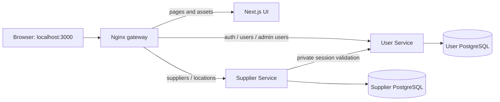

# Supplier D2 implementation steps

We are completing this in checkpoints so each change can be explained and verified.
The D2 target is a working independent Supplier API, PostgreSQL persistence, User
Service authorization and a responsive UI using live Supplier data.

| Step | Purpose | Status |
| --- | --- | --- |
| 1. Integrate main | Reuse the account UI and navy/orange design, preserve Supplier and include Credit's configuration | Complete; verified 2026-09-27 |
| 2. Complete Supplier API | Field editing, explicit deletion semantics, opening hours, inactive records, search/filter/sort/pagination | Complete; backend checks passed |
| 3. Connect Supplier UI | Replace sample state with API reads and writes; show server validation and generated metadata | Pending |
| 4. Apply UI permissions | Ordinary-user browsing and admin management; backend remains the authority | Pending |
| 5. Finish and demonstrate | Desktop/mobile checks, API-only and end-to-end evidence, schema/role/design explanations | Pending |

## Step 1: one shared application

The Supplier branch started from the User backend branch. Since then, `main`
received a shared frontend and Credit Service. Merging main brings their changes
into this branch without moving or changing the remote main branch.

Next.js presents the screens. Nginx routes requests. Go services enforce the rules
and access their own databases. A browser session created by User Service can be
used on Supplier requests; Supplier checks that session with User over the private
container network. The frontend does not receive the internal service credential.

Integration decisions:

- Keep main's account dialogs, Supplier preview components and responsive navy/orange styling.
- Keep the Supplier backend, seeded database, gateway and container check commands.
- Send browser User API calls to relative URLs through the gateway. Port 3000 belongs only to the gateway.
- Keep Credit's Compose include and its direct port 8082; use 8083 for Supplier's direct development port.
- Keep the frontend standalone runtime image and the existing pinned dependency versions.

**Checkpoint limitation:** account operations use the real User backend, but the
Supplier screens still use labelled sample data. The former minimal live Supplier
page is replaced by the shared UI. The Supplier APIs remain operational and
independently testable. Steps 2-4 restore and expand the live Supplier UI on this
shared design; this checkpoint is not a complete D2 submission.

Setup and checks are in the [root README](../README.md),
[frontend README](../frontend/README.md) and
[Supplier verification guide](../supplier-service/README.md#verification).

Verification completed for this checkpoint:

- Compose configuration is valid; User, Supplier, Credit, frontend and gateway start together without port conflicts. Supplier and Credit readiness endpoints return 200.
- Frontend ESLint, TypeScript checks and production build pass.
- Supplier and Credit formatting, vet, race-enabled unit/PostgreSQL integration tests and builds pass.
- The real-service smoke test passes ordinary-user browsing, rejected writes, admin create/deactivate, session revocation, Origin checks and private-route isolation.
- Headless Chrome passes UI signup, eight-digit email verification, login, session restoration after reload and logout, all through same-origin gateway APIs. Supplier reads use the resulting session and fail after logout.
- Desktop (1440px) and mobile (390px) catalogue screenshots and the mobile verification form were inspected; no horizontal overflow or browser runtime errors were found.

These local checks create generated test accounts and an inactive test supplier.
They do not validate the demo catalogue as a live Supplier UI; that remains a later checkpoint.

## Step 2: complete the independent API

Migration 003 adds optional opening hours, update/deletion timestamps and catalogue
indexes without changing applied migrations. PATCH edits metadata and status;
DELETE removes a supplier from public use while retaining its row for later Order
references. Inactive status remains a separate, reversible business state.

Catalogue queries use parameterized SQL, allowlisted ordering and bounded offset
pagination. Count and rows share a repeatable-read snapshot. Duplicate active names
at a location are enforced by the database. Integration tests cover query boundaries,
pagination, denied writes, atomic duplicate rejection, retained deletion and read/edit
behavior after deletion. Formatting, vet, race tests and compilation passed.

## Later checkpoints

Keep the architecture unchanged while completing the features. PostgreSQL can
serve the initial catalogue queries directly. Redis, RabbitMQ and cloud deployment
remain separate work; they are not substitutes for the D2 live-data and access
control demonstrations.

The supplied D2 instructions explicitly include deletion. Step 2 implements it as
soft deletion, separately from deactivation, and documents this choice in the API.
