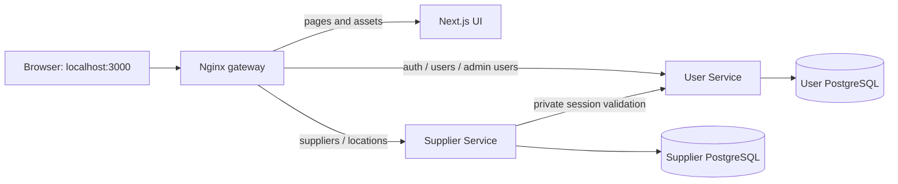

# Supplier D2 implementation steps

We are completing this in checkpoints so each change can be explained and verified.
The D2 target is a working independent Supplier API, PostgreSQL persistence, User
Service authorization and a responsive UI using live Supplier data.

| Step | Purpose | Status |
| --- | --- | --- |
| 1. Integrate main | Reuse the account UI and navy/orange design, preserve Supplier and include Credit's configuration | Complete; verified 2026-09-27 |
| 2. Complete Supplier API | Field editing, explicit deletion semantics, opening hours, inactive records, search/filter/sort/pagination | Complete; backend checks passed |
| 3. Connect Supplier UI | Replace sample state with API reads and writes; show server validation and generated metadata | Complete; lint, types and build passed |
| 4. Apply UI permissions | Ordinary-user browsing and admin management; backend remains the authority | Complete; lint, types and build passed |
| 5. Finish and demonstrate | Desktop/mobile checks, API-only and end-to-end evidence, schema/role/design explanations | Complete; API and browser checks passed |

## Step 1: one shared application

The Supplier branch started from the User backend branch. Since then, `main`
received a shared frontend and Credit Service. Merging main brings their changes
into this branch without moving or changing the remote main branch.

Next.js presents the screens. Nginx routes requests. Go services enforce the rules
and access their own databases. A browser session created by User Service can be
used on Supplier requests; Supplier checks that session with User over the private
container network. The frontend does not receive the internal service credential.

Integration decisions:

- Keep main's account dialogs, Supplier preview components and responsive navy/orange styling.
- Keep the Supplier backend, seeded database, gateway and container check commands.
- Send browser User API calls to relative URLs through the gateway. Port 3000 belongs only to the gateway.
- Keep Credit's Compose include and its direct port 8082; use 8083 for Supplier's direct development port.
- Keep the frontend standalone runtime image and the existing pinned dependency versions.

**Historical step 1 limitation (resolved in steps 2-4):** account operations used
the real User backend, while the shared Supplier screens still used labelled sample
data. Steps 2-4 replaced that sample state with live Supplier APIs and permissions.

Setup and checks are in the [root README](../README.md),
[frontend README](../frontend/README.md) and
[Supplier verification guide](../supplier-service/README.md#verification).

Verification completed for this checkpoint:

- Compose configuration is valid; User, Supplier, Credit, frontend and gateway start together without port conflicts. Supplier and Credit readiness endpoints return 200.
- Frontend ESLint, TypeScript checks and production build pass.
- Supplier and Credit formatting, vet, race-enabled unit/PostgreSQL integration tests and builds pass.
- The real-service smoke test passes ordinary-user browsing, rejected writes, admin create/deactivate, session revocation, Origin checks and private-route isolation.
- Headless Chrome passes UI signup, eight-digit email verification, login, session restoration after reload and logout, all through same-origin gateway APIs. Supplier reads use the resulting session and fail after logout.
- Desktop (1440px) and mobile (390px) catalogue screenshots and the mobile verification form were inspected; no horizontal overflow or browser runtime errors were found.

Those step 1 checks created generated test accounts and an inactive test supplier.
Step 5 below verifies the completed live Supplier UI.

## Step 2: complete the independent API

Migration 003 adds optional opening hours, update/deletion timestamps and catalogue
indexes without changing applied migrations. PATCH edits metadata and status;
DELETE removes a supplier from public use while retaining its row for later Order
references. Inactive status remains a separate, reversible business state.

Catalogue queries use parameterized SQL, allowlisted ordering and bounded offset
pagination. Count and rows share a repeatable-read snapshot. Duplicate active names
at a location are enforced by the database. Integration tests cover query boundaries,
pagination, denied writes, atomic duplicate rejection, retained deletion and read/edit
behavior after deletion. Formatting, vet, race tests and compilation passed.

## Step 3: persist the shared UI

The catalogue now loads records, controlled locations, details and totals through
Supplier APIs. Search/filter/order/page changes request new server results; obsolete
reads are cancelled. Create/edit forms retain invalid drafts and show backend
errors; successful saves display database-generated metadata. Confirmed deletion
calls DELETE and refreshes the page. Empty, loading and retry states are present.
All sample supplier data and browser-generated IDs/timestamps have been removed.
Frontend lint, TypeScript and production build passed; final browser evidence is
collected after the role controls are applied in step 4.

## Step 4: match controls to real permissions

The User Service response determines whether management controls are shown. Normal
users retain every browsing tool; only admins see add/edit/status/delete controls.
The backend remains authoritative and returns 403 for forbidden writes. A 401
clears the catalogue and open forms. Session checks on tab focus observe changes;
generation counters prevent old session responses from restoring a logged-out or
different account. Frontend lint, TypeScript and production build passed.

## Step 5: verify and prepare the demonstration

The [D2 demonstration guide](d2-supplier-demo.md) includes component, sequence and
schema diagrams, a role matrix, query/design decisions, reproducible commands and
a suggested demonstration sequence. The browser harness runs in a dedicated
Playwright container against the real User and Supplier services.

Final verification completed on 2026-09-27:

- Frontend lint, TypeScript and production build passed after the final UI changes.
- Direct API checks passed with both frontend and gateway stopped: persisted CRUD,
  combined catalogue queries, duplicate rejection, ordinary-user write denial,
  session revocation and Origin checks. The UI services were restored afterward.
- Browser checks passed real signup/email verification/login/session restoration,
  live pagination/filter/sort, empty and retry states, persisted create/edit/delete,
  duplicate errors retaining drafts, deactivation/reactivation and cancelled deletion.
- Actual User role changes revoked sessions; Supplier UI cleared on revoked access
  and logout. Ordinary users could browse but could not manage suppliers through
  either UI or API. No browser runtime errors occurred.
- Desktop 1440px and mobile 390px/320px checks passed without horizontal overflow;
  screenshots were inspected. Native dialogs trap focus and restore it on close.

Local evidence is under ignored `.agent/tmp/d2-browser/`; rerun
`sh scripts/browser-check.sh` before presenting. Generated test accounts and retained
soft-deleted suppliers remain in the local databases. Backend format, vet,
race-enabled PostgreSQL integration tests and build passed in step 2; no backend
source changed in subsequent UI/documentation steps.

## Scope remaining outside this Supplier D2 implementation

PostgreSQL serves the catalogue directly. Redis, RabbitMQ workflows, Order/Credit
business integration, cloud deployment and concurrent-load NFR verification remain
separate work. User Service's broader milestone obligations still need to be reviewed
by its owner; this implementation does not establish the whole team's D2 completion.

The supplied D2 instructions explicitly include deletion. Step 2 implements it as
soft deletion, separately from deactivation, and documents this choice in the API.
