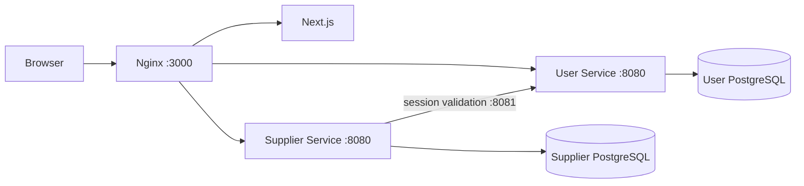

# Supplier Service

Go `net/http` + `pgx` + PostgreSQL, integrated with the existing User Service's server-side sessions. The D2 backend supports CRUD, controlled metadata and server-side catalogue queries. See the [implementation checkpoints](../docs/d2-supplier-progress.md) for UI progress.

## Run the shared application

Use Docker with Compose. On Windows, run these commands in WSL if Docker is installed in Ubuntu:

```sh
cd /mnt/c/Users/cms07/CS3219/FoC-Template # adjust for your checkout
sh user-service/scripts/init-env.sh
sh credit-service/scripts/init-env.sh
docker compose up --build -d gateway
```

Open **http://localhost:3000**. The setup script creates local secrets or adds a missing Supplier database password to an existing `.env`, preserving existing values. Keep `USER_APP_ORIGIN=http://localhost:3000` for this local gateway. Use `localhost` consistently rather than mixing it with `127.0.0.1`.

The browser uses relative `/api/v1/...` URLs. Nginx forwards User routes to User Service and Supplier routes to Supplier Service, preserving the browser cookie and Origin header. No credentials are embedded in the frontend. The internal validation route is never publicly proxied.



| Address | Purpose |
| --- | --- |
| `http://localhost:3000` | Shared frontend and public APIs |
| `http://localhost:8025` | Local Mailpit verification inbox |
| `http://localhost:8083/readyz` | Direct Supplier readiness check |
| `http://user-service:8081` | Private authentication API inside Compose |
| `supplier-db:5432` | Supplier database; no published host port |

Set `USER_HTTP_PORT` or `SUPPLIER_HTTP_PORT` in `.env` if direct API ports 8080/8083 are occupied. Credit uses 8082, so existing Supplier checkouts must change their old `SUPPLIER_HTTP_PORT=8082` setting to 8083. This does not change the gateway URL or internal service ports. Supplier and User have separate database users, passwords and named volumes. Containers can be stopped with `docker compose stop`; volumes preserve data. Avoid `down -v` unless you intend to erase local data.

## Accounts and current UI

The shared navy/orange UI includes signup, email verification, login and logout against the existing [User API](../user-service/API.md). Read local verification codes in Mailpit at port 8025. Supplier screens now use live API queries and persisted CRUD operations, with loading/error/empty states and database-assigned metadata. The API remains independently usable. See the [D2 steps](../docs/d2-supplier-progress.md) for permission and final verification progress.

To make your verified account an admin:

```sh
docker compose exec user-service user-service promote-admin your-email@u.nus.edu
```

Log in again after promotion. Supplier enforces permissions independently on every API request. The UI shows management controls only to admins; ordinary users can browse, search, filter, sort and inspect active/inactive records. Expired or revoked sessions clear the catalogue and forms.

## Implemented boundaries

- Own Go process, configuration, graceful shutdown, JSON logs, liveness and database readiness endpoints.
- Authenticated supplier list/detail and campus locations; admin create, field/status editing and soft deletion. Inactive records remain readable; deleted records are hidden and cannot be modified.
- Server-side search, category/location/status filtering, allowlisted sorting and bounded pagination with consistent totals. Opening hours and update timestamps are included; existing migrations and seed data are preserved.
- Every protected request validates the existing cookie through User's internal API using the shared backend credential, with a two-second timeout. Invalid sessions return 401. Bad backend credentials, malformed responses, timeouts and User outages return 503. There is no positive authentication cache.
- Exact Origin checks for mutations, JSON-only bodies, request-size limits and rejection of unknown fields, matching User's browser integration.
- Database constraints enforce allowed categories, controlled locations and case-insensitive active-name uniqueness at a location, including concurrent writes.
- Numbered migrations run in a transaction under an advisory lock. Seed migration imports all 21 records from the repository CSV once; restarts do not reinsert records or undo admin edits.
- Seed normalization maps `Shopping` to `retail`, `Food/Coffee` to `food`, `Com 2`/`Com2` to `COM2`, and curly apostrophes in building names to straight apostrophes. Location means building in this skeleton; floor and pickup directions are stored in the description.

See [API.md](API.md) for request/response contracts. `internal/supplier/auth.go` is the User integration; `http.go` owns routes and middleware; `suppliers.go` owns minimal operations; `store.go` applies migrations; `cmd/server/main.go` owns startup/shutdown.

## Verification

```sh
docker compose --profile test run --build --rm supplier-tests
docker compose --profile test run --build --rm frontend-checks
sh scripts/smoke.sh
```

Backend checks include `gofmt`, `go vet`, race-enabled tests against a dedicated temporary PostgreSQL database, and compilation. Tests cover User request contracts, no auth caching, upstream failures, role restrictions, Origin checks, input validation, duplicate concurrent writes and repeatable migrations. Frontend checks run ESLint, TypeScript and a production build.

The smoke script uses the real gateway, User Service, Mailpit and Supplier Service. It verifies registration, email verification, ordinary-user browsing, denied writes, admin promotion/create/deactivate, logout revocation, CSRF checks and isolation of `/internal`. It creates one randomly named local account and supplier; the supplier ends inactive. It never prints passwords, codes or cookies. The account remains in local data and its random password is discarded at script exit; use your own verified account for manual browsing.

ESLint 9 is pinned because the React/import plugins bundled with the selected Next.js configuration do not yet support ESLint 10; npm currently marks ESLint 9 deprecated. It is a development dependency, excluded from the runtime image.

## Explicitly deferred

Image/coordinate fields and image serving, Order integration, Redis caching, RabbitMQ events and load testing remain future work. The seed CSV retains the additional source metadata. D2 verification is tracked in the checkpoint document.

This Compose setup binds public ports to loopback for local use. EC2 deployment still needs HTTPS ingress, secure cookies, deployment secrets, a real email provider, backup policy and appropriate network access. Services can communicate by Compose DNS on one host. The gateway re-resolves those names when containers are replaced. User's existing peer-IP rate limit sees gateway traffic as one source; a production trusted-proxy/rate-limit policy remains open.
